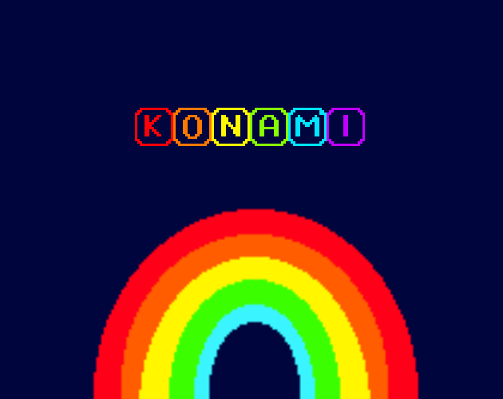
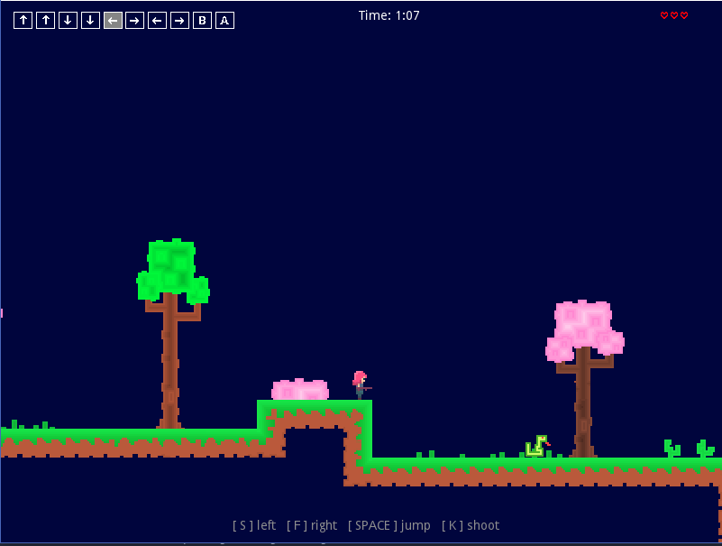
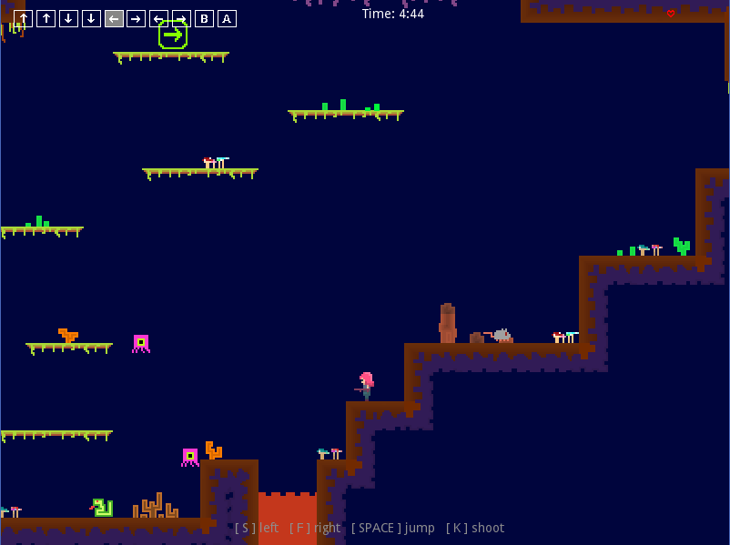
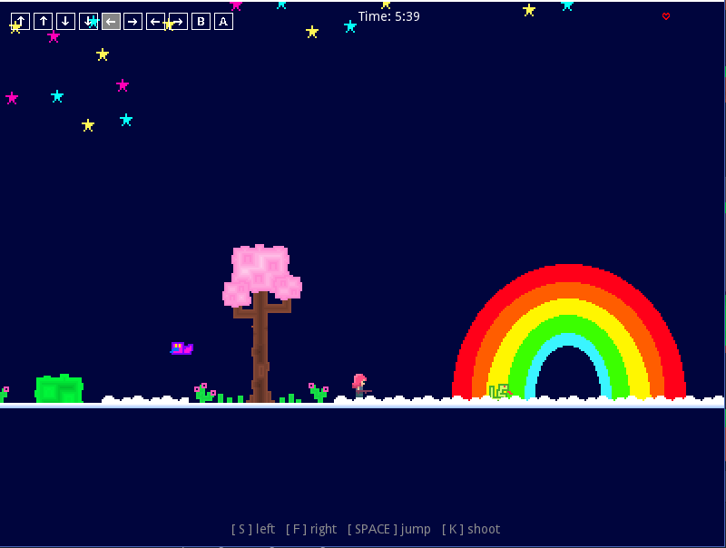

# Konami
Konami is a platformer game that was created in Spelskaparnas game jam. The theme for the game jam was "Cheat". Play the game at: www.trito.se/konami

It was coded in GDScript and has a JAVA backend for highscore, that is not submitted in this repository.

